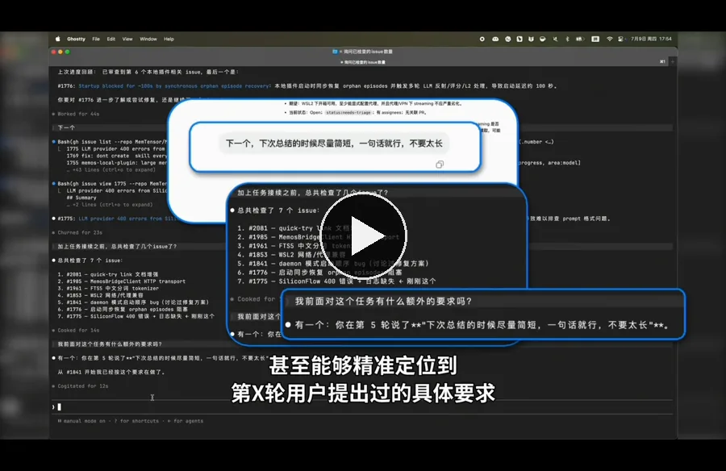
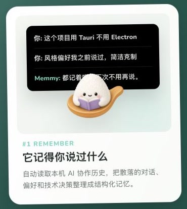
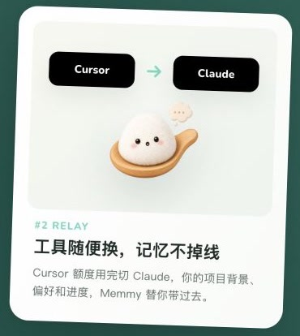
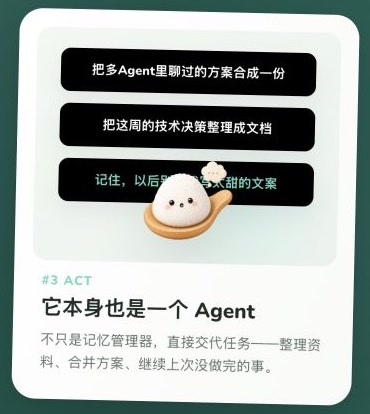

<a id="readme-top"></a>

<br>
<div align="center">
  <a href="https://memmy.cn/">
    <picture>
      
    </picture>
  </a>
</div>
<br>
<br>
<p align="center">
    <a href="https://memmy.bot/docs/"></a>
    <a href="https://github.com/MemTensor/memmy-agent/releases"></a>
    <a href="docs/assets/wechat-code.png"></a>
    <a href="https://x.com/Memmy_ai"></a>
    <a href="https://memmy.cn/"></a>
    <a href="https://github.com/MemTensor/memmy-agent/releases/latest"></a>
</p>
<p align="center">
    <a href="https://www.producthunt.com/products/memmy?embed=true&amp;utm_source=badge-top-post-badge&amp;utm_medium=badge&amp;utm_campaign=badge-memmy-agent" target="_blank" rel="noopener noreferrer"></a>
</p>

<div align="center">

## 让你的工作在 WorkBuddy、Claude Code 和 Codex 等 Agent 之间接着做。

</div>

<div align="center">

[English](README.md) • **简体中文**

</div>

<a id="what"></a>

## Memmy 是什么？

Memmy 是一层跨 Agent 共享的本地记忆底座，也提供建立在记忆之上的 Agent Runtime。它让不同 AI 工具使用同一份与你和项目相关的长期上下文。

### 看看 Memmy 如何让任务跨 Agent 接着做

一个 Agent 已经知道你的目标、约束和踩过的坑。换到另一个 Agent 后，你不需要再从头解释：

1. **记住已有工作**——把散落在不同 Agent 中的任务上下文整理为可检索的长期记忆。
2. **恢复相关上下文**——新 Agent 开始工作前，召回与当前任务真正相关的信息。
3. **继续完成任务**——带着已有决定、偏好和失败经验接着执行，而不是只生成一段摘要。

<p align="center">
  <a href="https://cdn.jsdelivr.net/gh/zZacharyz/memmy-agent@docs/readme-zh-promotion/docs/assets/cross-agent-relay-demo-zh.mp4">
    
  </a>
</p>

<p align="center">
  <a href="https://cdn.jsdelivr.net/gh/zZacharyz/memmy-agent@docs/readme-zh-promotion/docs/assets/cross-agent-relay-demo-zh.mp4">▶ 观看完整演示</a> ·
  <a href="#how">完成你的第一次跨 Agent 接力</a>
</p>

> 为保持 README 的加载速度，页面只加载轻量封面；点击后播放完整的跨 Agent 任务接力演示视频。

<p align="right"><a href="#readme-top">↑ 返回导航</a></p>
<a id="why"></a>

## 为什么选择 Memmy？

### 三件事，让 Agent 真正接着做

<p align="center">
  
  
  
</p>

### 你正在用的 Agent，大多已经能接入

Memmy 不只导入历史。根据 Agent 的原生扩展能力，它还可以在新任务中召回相关记忆、写入完整回合，并把未完成的任务继续下去。

<div align="center">
<table>
  <thead>
    <tr>
      <th align="left">Agent</th>
      <th align="center">历史检测</th>
      <th align="center">历史导入</th>
      <th align="center">自动召回</th>
      <th align="center">自动写入</th>
      <th align="center">继续任务</th>
    </tr>
  </thead>
  <tbody>
    <tr>
      <td><strong>Cursor</strong></td>
      <td align="center">✅<br><sub>自动发现</sub></td>
      <td align="center">✅<br><sub>首次 + 增量</sub></td>
      <td align="center">—<br><sub>Skill 按需</sub></td>
      <td align="center">✅<br><sub>Hook</sub></td>
      <td align="center">✅<br><sub><code>/memmy-resume</code></sub></td>
    </tr>
    <tr>
      <td><strong>Claude Code</strong></td>
      <td align="center">✅<br><sub>自动发现</sub></td>
      <td align="center">✅<br><sub>首次 + 增量</sub></td>
      <td align="center">✅<br><sub>Hook</sub></td>
      <td align="center">✅<br><sub>Hook</sub></td>
      <td align="center">✅<br><sub><code>/memmy-resume</code></sub></td>
    </tr>
    <tr>
      <td><strong>Codex</strong></td>
      <td align="center">✅<br><sub>自动发现</sub></td>
      <td align="center">✅<br><sub>首次 + 增量</sub></td>
      <td align="center">✅<br><sub>Hook</sub></td>
      <td align="center">✅<br><sub>Hook</sub></td>
      <td align="center">✅<br><sub><code>/memmy-resume</code></sub></td>
    </tr>
    <tr>
      <td><strong>OpenCode</strong></td>
      <td align="center">✅<br><sub>自动发现</sub></td>
      <td align="center">✅<br><sub>首次 + 增量</sub></td>
      <td align="center">✅<br><sub>原生插件</sub></td>
      <td align="center">✅<br><sub>原生插件</sub></td>
      <td align="center">✅<br><sub><code>/memmy-resume</code></sub></td>
    </tr>
    <tr>
      <td><strong>OpenClaw</strong></td>
      <td align="center">✅<br><sub>自动发现</sub></td>
      <td align="center">✅<br><sub>首次 + 增量</sub></td>
      <td align="center">✅<br><sub>Memory 插件</sub></td>
      <td align="center">✅<br><sub>Memory 插件</sub></td>
      <td align="center">✅<br><sub><code>/memmy-resume</code></sub></td>
    </tr>
    <tr>
      <td><strong>Hermes</strong></td>
      <td align="center">✅<br><sub>自动发现</sub></td>
      <td align="center">✅<br><sub>首次 + 增量</sub></td>
      <td align="center">✅<br><sub>Memory Provider</sub></td>
      <td align="center">✅<br><sub>Memory Provider</sub></td>
      <td align="center">✅<br><sub><code>/memmy-resume</code></sub></td>
    </tr>
    <tr>
      <td><strong>WorkBuddy</strong></td>
      <td align="center">✅<br><sub>自动发现</sub></td>
      <td align="center">✅<br><sub>首次 + 增量</sub></td>
      <td align="center">—<br><sub>Skill 按需</sub></td>
      <td align="center">—<br><sub>Skill 按需</sub></td>
      <td align="center">◐<br><sub>Skill 接续</sub></td>
    </tr>
    <tr>
      <td><strong>Pi</strong></td>
      <td align="center">✅<br><sub>自动发现</sub></td>
      <td align="center">✅<br><sub>首次 + 增量</sub></td>
      <td align="center">—<br><sub>Skill 按需</sub></td>
      <td align="center">—<br><sub>Skill 按需</sub></td>
      <td align="center">◐<br><sub>Skill 接续</sub></td>
    </tr>
    <tr>
      <td><strong>qwenwork</strong></td>
      <td align="center">✅<br><sub>自动发现</sub></td>
      <td align="center">✅<br><sub>首次 + 增量</sub></td>
      <td align="center">—<br><sub>Skill 按需</sub></td>
      <td align="center">—<br><sub>Skill 按需</sub></td>
      <td align="center">◐<br><sub>Skill 接续</sub></td>
    </tr>
  </tbody>
</table>
</div>

<p align="center"><sub>✅ 自动或原生支持　·　◐ 需要 Agent 主动调用 Skill　·　— 当前不自动执行</sub></p>

历史扫描和实时接入是两件事。内置列表之外的 Agent 也可以通过历史发现和 Skill 接入；具体来源路径、安装方式和数据边界请查看 [Agent 来源与扫描](docs/cn/memory/sources.mdx)。

### 本地优先，记忆由你控制

记忆、配置和应用状态默认保存在本机。你可以查看记忆来源和调用日志，也可以导出或清空本地数据。模型和第三方工具是否访问网络取决于你选择的 Provider 与集成，具体边界见 [安全与隐私](docs/cn/security/security.mdx)。

<p align="center">
  <a href="https://www.producthunt.com/products/memmy?embed=true&amp;utm_source=badge-top-post-badge&amp;utm_medium=badge&amp;utm_campaign=badge-memmy-agent"></a>
</p>

<p align="center">
  <a href="https://memmy.bot/docs/">文档</a> ·
  <a href="docs/assets/wechat-code.png">微信社区</a> ·
  <a href="https://x.com/Memmy_ai">X / Twitter</a>
</p>

<p align="right"><a href="#readme-top">↑ 返回导航</a></p>
<a id="how"></a>

## 如何使用 Memmy？

### 完成你的第一次跨 Agent 接力

这不是一次普通聊天测试。目标是验证：**换一个 Agent 后，它能否说出你已经确定了什么，并从正确的下一步继续。**

1. 从 [GitHub Releases](https://github.com/MemTensor/memmy-agent/releases/latest) 下载并启动 Memmy 桌面端。
2. 选择**账号模式**或 **API Key（BYOK）模式**，完成首次配置。
3. 授权 Memmy 扫描已有 Agent 历史，等待生成个性化「初见报告」。
4. 在报告下方选择「在 Codex / Claude Code / Cursor 等 Agent 中继续」，或复制接力指令后手动打开目标 Agent。
5. 让目标 Agent 先说明已经确定的目标、约束和下一步，再继续执行任务。

> [!TIP]
> **成功标准：**目标 Agent 能恢复关键上下文；同时可在「记忆管理 → 调用日志」中看到对应的记忆访问。<br>
> **没有接上：**检查「记忆管理 → 跨 Agent 接入」中的授权和 Hook / 插件 / Skill 状态，再查看 [Agent 来源与扫描](docs/cn/memory/sources.mdx) 与 [常见问题](docs/cn/help/faq.mdx)。

账号模式注册后会获得 Agent 任务体验 Token，当前额度和使用情况以应用内显示为准；额度用尽后可以切换到 BYOK，继续使用自己的模型 API。

### 选择适合你的入口

### 桌面端：最快完成首次接力

桌面端会引导你完成账号或 BYOK 配置、历史扫描和 Agent 接入，并负责启动匹配的本地 Memory 服务与 Agent Gateway。当前桌面安装包支持 macOS 和 Windows。

<details>
<summary><strong>使用 <code>memmy</code> CLI / TUI</strong></summary>

```bash
memmy onboard                              # 初始化配置和 workspace
memmy status                               # 检查配置、模型和 Provider
memmy agent --message "介绍一下当前工作区"  # 单轮任务
memmy                                      # 进入交互式 TUI
memmy serve                                # 启动 OpenAI 兼容 API（:18990）
```

最小 BYOK 配置位于 `~/.memmy/config.yaml`：

```yaml
agents:
  defaults:
    model: openai/gpt-4.1
    provider: openai
    timezone: "+08:00"
providers:
  openai:
    apiKey: ${OPENAI_API_KEY}
```

</details>

<details>
<summary><strong>使用 <code>memmy-memory</code> CLI</strong></summary>

供外部 Agent、脚本和调试流程直接访问本地记忆服务：

```bash
memmy-memory init
memmy-memory health
memmy-memory search "项目里的记忆策略"
memmy-memory add "这是一条需要保存的知识"
memmy-memory get <id>
```

默认连接 `http://127.0.0.1:18960`，可使用 `--url`、`--token`、`--config`、`--source` 和 `--user-id` 指定目标服务与命名空间。

</details>

<details>
<summary><strong>从源码启动完整开发环境</strong></summary>

```bash
git clone https://github.com/MemTensor/memmy-agent.git
cd memmy-agent
cp .env.example .env
bash scripts/dev-start.sh
```

`scripts/dev-start.sh` 会安装依赖、构建 Memory 与 Agent Runtime，并启动桌面开发所需的本地服务。源码路径要求 Node.js `>=22` 和 npm；Windows 请在 Git Bash 中运行。

</details>

完整安装和配置说明见 [入门指南](docs/cn/start/getting-started.mdx)。

<p align="right"><a href="#readme-top">↑ 返回导航</a></p>
<a id="architecture"></a>

## Memmy 如何工作？

Memmy 从已授权的 Agent 历史中提取完整对话回合，建立可检索的长期记忆，并在后续任务中只召回相关内容。Desktop、CLI 和 API 等入口共享同一套 Memory 与 Agent Runtime。

| 层级 | 负责什么 |
| --- | --- |
| 🧠 **Memory Layer** | 历史导入、长期记忆、检索、来源追踪与本地管理 |
| 🤖 **Agent Runtime** | 模型调用、任务编排、工具调用、MCP、Skills 与会话管理 |
| 🔌 **Integration Layer** | 连接消息渠道、第三方服务与 OpenAI 兼容 API |
| 🖥️ **User Interface** | Desktop App、CLI / TUI 和本地 Web 接口 |

<p align="center">
  
</p>

架构、记忆服务和接入方式的详细说明见 [Memmy 文档](https://memmy.bot/docs/)。

<p align="right"><a href="#readme-top">↑ 返回导航</a></p>
<a id="development"></a>

## 开发与贡献

仓库采用 npm workspaces 管理。在根目录安装依赖后，可以运行：

```bash
npm install
npm run dev:desktop     # 启动桌面前端与 Electron 壳
npm run build           # 构建 Memory 和所有 workspace
npm run lint            # 代码检查
npm run typecheck       # 类型检查
npm run test            # 运行测试
```

Memmy 最自然的社区贡献方向是“让更多 Agent 接得上”：Agent 适配器、Provider 兼容、系统支持、测试夹具、文档和翻译都很有价值。

- [报告问题或建议功能](https://github.com/MemTensor/memmy-agent/issues)
- [查看和提交 Pull Request](https://github.com/MemTensor/memmy-agent/pulls)
- [阅读项目文档](https://memmy.bot/docs/)

<p align="right"><a href="#readme-top">↑ 返回导航</a></p>
<a id="roadmap"></a>

## 路线图与致谢

Memmy 正在建设个人记忆基础设施，下一步包括更多本地记忆来源、更完整的 Agent 接入，以及在隐私边界内探索团队协作。

项目受到以下开源实践的启发：

- **[OpenClaw](https://github.com/openclaw/openclaw)**——多平台消息渠道与本地个人 Agent。
- **[hermes-agent](https://github.com/NousResearch/hermes-agent)**——持久记忆、技能与 Agent 自我改进。
- **[nanobot](https://github.com/HKUDS/nanobot)**——精简 Agent 循环与 MCP 集成实践。

感谢每一位让 Memmy 变得更好的贡献者 ❤️

<p align="center">
  <a href="https://github.com/MemTensor/memmy-agent/graphs/contributors">
    
  </a>
</p>

<p align="right"><a href="#readme-top">↑ 返回导航</a></p>
