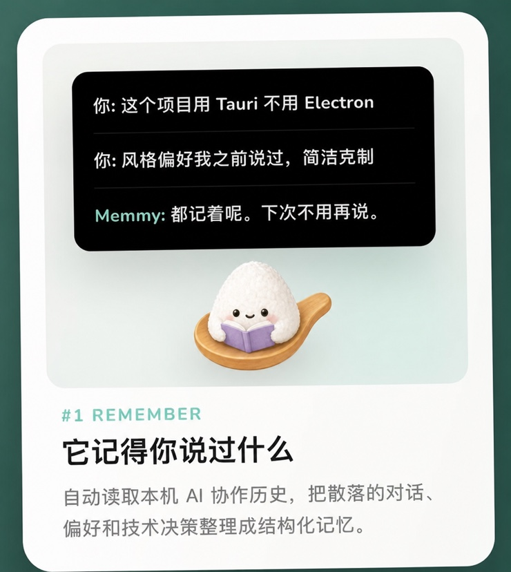
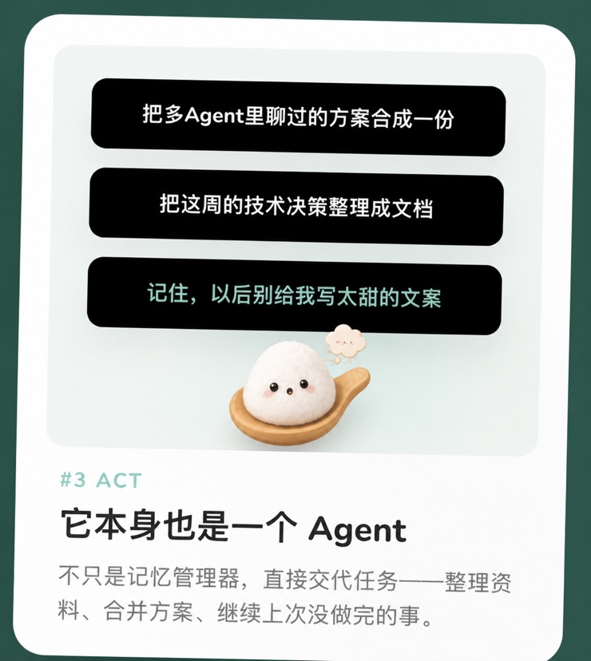

<br>
<div align="center">
  <a href="https://memmy.cn/">
    <picture>
      
    </picture>
  </a>
</div>
<br>

<div align="center">

## 让你的工作在 WorkBuddy、Claude Code 和 Codex 等 Agent 之间接着做。

</div>

<div align="center">

[English](README.md) • **简体中文**

</div>

<p align="center">
  <a href="https://memmy.cn/"></a>&ensp;<a href="https://github.com/MemTensor/memmy-agent/releases/latest"></a>
</p>

<p align="center">
  <a href="https://memmy.bot/docs/"></a>
  <a href="https://github.com/MemTensor/memmy-agent/releases"></a>
  <a href="docs/assets/wechat-code.png"></a>
  <a href="https://x.com/Memmy_ai"></a>
</p>

<p align="center"></p>

<a id="what"></a>

## Memmy 是什么？

Memmy 是跨 Agent 的本地记忆与执行层。它让不同 AI 工具共享长期上下文，并通过 Agent Runtime 继续任务。

### 任务如何跨 Agent 接着做

<div align="center">
<table>
  <tbody>
    <tr>
      <td align="center" width="33%"><strong>01 · 记住</strong><br><sub>整理目标、决定、偏好和失败尝试</sub></td>
      <td align="center" width="34%"><strong>02 · 接力</strong><br><sub>切换 Agent 时带上相关上下文</sub></td>
      <td align="center" width="33%"><strong>03 · 继续</strong><br><sub>沿用已有约束和进度执行</sub></td>
    </tr>
  </tbody>
</table>
</div>

<p align="center">
  <a href="https://cdn.jsdelivr.net/gh/zZacharyz/memmy-agent@docs/readme-zh-promotion/docs/assets/cross-agent-relay-demo-zh.mp4">
    
  </a>
</p>

<p align="center">
  <a href="https://cdn.jsdelivr.net/gh/zZacharyz/memmy-agent@docs/readme-zh-promotion/docs/assets/cross-agent-relay-demo-zh.mp4">▶ 观看完整演示</a> ·
  <a href="#how">完成你的第一次跨 Agent 接力</a>
</p>

<p align="center"><sub>README 仅加载轻量封面，点击即可观看完整视频。</sub></p>

<p align="center"></p>

<a id="why"></a>

## 为什么选择 Memmy？

### 三件事，让 Agent 真正接着做

<p align="center">
  
  
  
</p>

### 你正在用的 Agent，大多已经能接入

Memmy 不只导入历史，也能召回、写入和接续任务；具体能力取决于 Agent 的接入方式。

<div align="center">
<table>
  <thead>
    <tr>
      <th align="center" width="25%">Agent</th>
      <th align="center" width="15%">历史检测</th>
      <th align="center" width="15%">历史导入</th>
      <th align="center" width="15%">自动召回</th>
      <th align="center" width="15%">自动写入</th>
      <th align="center" width="15%">继续任务</th>
    </tr>
  </thead>
  <tbody>
    <tr>
      <td align="center"><strong>DeepSeek Harness</strong></td>
      <td align="center">✅</td>
      <td align="center">✅</td>
      <td align="center">✅</td>
      <td align="center">✅</td>
      <td align="center">✅</td>
    </tr>
    <tr>
      <td align="center"><strong>Cursor</strong></td>
      <td align="center">✅</td>
      <td align="center">✅</td>
      <td align="center">🧩</td>
      <td align="center">✅</td>
      <td align="center">✅</td>
    </tr>
    <tr>
      <td align="center"><strong>Claude Code</strong></td>
      <td align="center">✅</td>
      <td align="center">✅</td>
      <td align="center">✅</td>
      <td align="center">✅</td>
      <td align="center">✅</td>
    </tr>
    <tr>
      <td align="center"><strong>Codex</strong></td>
      <td align="center">✅</td>
      <td align="center">✅</td>
      <td align="center">✅</td>
      <td align="center">✅</td>
      <td align="center">✅</td>
    </tr>
    <tr>
      <td align="center"><strong>OpenCode</strong></td>
      <td align="center">✅</td>
      <td align="center">✅</td>
      <td align="center">✅</td>
      <td align="center">✅</td>
      <td align="center">✅</td>
    </tr>
    <tr>
      <td align="center"><strong>OpenClaw</strong></td>
      <td align="center">✅</td>
      <td align="center">✅</td>
      <td align="center">✅</td>
      <td align="center">✅</td>
      <td align="center">✅</td>
    </tr>
    <tr>
      <td align="center"><strong>Hermes</strong></td>
      <td align="center">✅</td>
      <td align="center">✅</td>
      <td align="center">✅</td>
      <td align="center">✅</td>
      <td align="center">✅</td>
    </tr>
    <tr>
      <td align="center"><strong>WorkBuddy</strong></td>
      <td align="center">✅</td>
      <td align="center">✅</td>
      <td align="center">🧩</td>
      <td align="center">🧩</td>
      <td align="center">🔄</td>
    </tr>
    <tr>
      <td align="center"><strong>Pi</strong></td>
      <td align="center">✅</td>
      <td align="center">✅</td>
      <td align="center">🧩</td>
      <td align="center">🧩</td>
      <td align="center">🔄</td>
    </tr>
    <tr>
      <td align="center"><strong>qwenwork</strong></td>
      <td align="center">✅</td>
      <td align="center">✅</td>
      <td align="center">🧩</td>
      <td align="center">🧩</td>
      <td align="center">🔄</td>
    </tr>
  </tbody>
</table>
</div>

<p align="center"><sub>✅ 自动或原生支持　　🧩 Skill 按需执行　　🔄 Skill 接续任务</sub></p>

历史扫描负责导入；Hook、插件或 Skill 负责实时接入。来源路径与数据边界见 [Agent 来源与扫描](docs/cn/memory/sources.mdx)。

### 本地优先，记忆由你控制

记忆、配置和应用状态默认保存在本机，可查看、导出或清空。网络边界取决于 Provider 与集成，详见 [安全与隐私](docs/cn/security/security.mdx)。

<p align="center">
  <a href="https://www.producthunt.com/products/memmy?embed=true&amp;utm_source=badge-top-post-badge&amp;utm_medium=badge&amp;utm_campaign=badge-memmy-agent"></a>
</p>

<p align="center"></p>

<a id="how"></a>

## 如何使用 Memmy？

### 完成你的第一次跨 Agent 接力

目标：验证切换 Agent 后，能否恢复关键上下文并继续任务。

1. 从 [GitHub Releases](https://github.com/MemTensor/memmy-agent/releases/latest) 下载并启动 Memmy 桌面端。
2. 选择**账号模式**或 **BYOK**，完成配置。
3. 授权扫描 Agent 历史，生成「初见报告」。
4. 选择「在某 Agent 中继续」，或复制接力指令。
5. 确认目标 Agent 已恢复目标、约束和下一步，再继续任务。

> [!TIP]
> **成功：**目标 Agent 恢复关键上下文，调用日志出现对应记忆访问。<br>
> **失败：**检查跨 Agent 授权与接入状态，再查看 [Agent 来源与扫描](docs/cn/memory/sources.mdx) 和 [常见问题](docs/cn/help/faq.mdx)。

账号模式赠送体验 Token；额度以应用内为准，用尽后可切换 BYOK。

### 桌面端（推荐）

桌面端负责配置、历史扫描、Agent 接入及本地服务启动，支持 macOS 和 Windows。

<details>
<summary><strong>使用 <code>memmy</code> CLI / TUI</strong></summary>

```bash
memmy onboard                              # 初始化配置和 workspace
memmy status                               # 检查配置、模型和 Provider
memmy agent --message "介绍一下当前工作区"  # 单轮任务
memmy                                      # 进入交互式 TUI
memmy serve                                # 启动 OpenAI 兼容 API（:18990）
```

最小 BYOK 配置位于 `~/.memmy/config.yaml`：

```yaml
agents:
  defaults:
    model: openai/gpt-4.1
    provider: openai
    timezone: "+08:00"
providers:
  openai:
    apiKey: ${OPENAI_API_KEY}
```

</details>

<details>
<summary><strong>使用 <code>memmy-memory</code> CLI</strong></summary>

供 Agent、脚本和调试流程访问本地记忆服务：

```bash
memmy-memory init
memmy-memory health
memmy-memory search "项目里的记忆策略"
memmy-memory add "这是一条需要保存的知识"
memmy-memory get <id>
```

默认连接 `http://127.0.0.1:18960`；可用 `--url`、`--token`、`--config`、`--source` 和 `--user-id` 指定服务与命名空间。

</details>

<details>
<summary><strong>从源码启动完整开发环境</strong></summary>

```bash
git clone https://github.com/MemTensor/memmy-agent.git
cd memmy-agent
cp .env.example .env
bash scripts/dev-start.sh
```

脚本会安装依赖、构建服务并启动开发环境。需要 Node.js `>=22` 和 npm；Windows 请使用 Git Bash。

</details>

完整安装和配置说明见 [入门指南](docs/cn/start/getting-started.mdx)。

<p align="center"></p>

<a id="architecture"></a>

## Memmy 如何工作？

Memmy 将 Agent 历史整理为长期记忆，并按任务召回相关内容。Desktop、CLI 和 API 共享同一套 Memory 与 Agent Runtime。

<div align="center">
<table>
  <thead>
    <tr>
      <th align="center" width="34%">层级</th>
      <th align="left" width="66%">负责什么</th>
    </tr>
  </thead>
  <tbody>
    <tr>
      <td align="center">🧠 <strong>Memory Layer</strong></td>
      <td>导入、存储、检索与溯源</td>
    </tr>
    <tr>
      <td align="center">🤖 <strong>Agent Runtime</strong></td>
      <td>模型、任务、工具、MCP 与 Skills</td>
    </tr>
    <tr>
      <td align="center">🔌 <strong>Integration Layer</strong></td>
      <td>消息渠道、第三方服务与兼容 API</td>
    </tr>
    <tr>
      <td align="center">🖥️ <strong>User Interface</strong></td>
      <td>Desktop、CLI / TUI 与本地 Web</td>
    </tr>
  </tbody>
</table>
</div>

<p align="center">
  
</p>

架构、记忆服务和接入方式的详细说明见 [Memmy 文档](https://memmy.bot/docs/)。

<p align="center"></p>

<a id="development"></a>

## 开发与贡献

仓库使用 npm workspaces。在根目录运行：

```bash
npm install
npm run dev:desktop     # 启动桌面前端与 Electron 壳
npm run build           # 构建 Memory 和所有 workspace
npm run lint            # 代码检查
npm run typecheck       # 类型检查
npm run test            # 运行测试
```

欢迎贡献 Agent 适配器、Provider、系统支持、测试、文档和翻译。

- [报告问题或建议功能](https://github.com/MemTensor/memmy-agent/issues)
- [查看和提交 Pull Request](https://github.com/MemTensor/memmy-agent/pulls)
- [阅读项目文档](https://memmy.bot/docs/)

<p align="center"></p>

<a id="roadmap"></a>

## 路线图与致谢

下一步：更多本地记忆来源、更完整的 Agent 接入，以及隐私边界内的团队协作。

灵感来自：

- **[OpenClaw](https://github.com/openclaw/openclaw)**：多平台、本地 Agent。
- **[hermes-agent](https://github.com/NousResearch/hermes-agent)**：持久记忆与技能。
- **[nanobot](https://github.com/HKUDS/nanobot)**：精简 Agent 循环与 MCP。

感谢每一位让 Memmy 变得更好的贡献者 ❤️

<p align="center">
  <a href="https://github.com/MemTensor/memmy-agent/graphs/contributors">
    
  </a>
</p>
